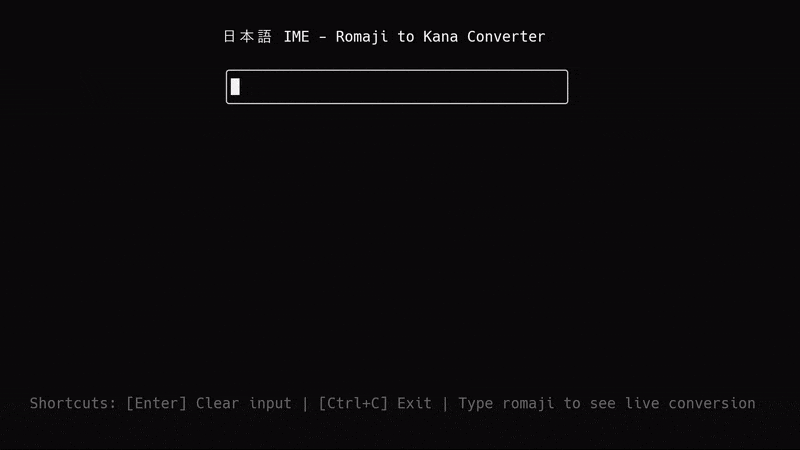

# Jaime

A Japanese IME (Input Method Editor) engine for Zig projects, focusing on romaji to hiragana/full-width character conversion. Based on Google IME behavior.

<table>
<tr>
<td>

On the **terminal** with libvaxis

[View repository](https://github.com/egegungordu/ja-ime-terminal-demo)



</td>
<td>

On the **web** with webassembly

Coming soon!


</td>
</tr>
</table>

## Zig Version

The minimum Zig version required is 0.13.0.

## Integrating jaime into your Zig Project

You first need to add jaime as a dependency in your `build.zig.zon` file:

```bash
zig fetch --save git+https://github.com/egegungordu/jaime
```

Then instantiate the dependency in your `build.zig`:

```zig
const jaime = b.dependency("jaime", .{});
exe.root_module.addImport("jaime", jaime.module("jaime"));
```

## Usage

The library provides several ways to convert romaji (Latin characters) to hiragana:

### Quick Conversion Functions

For simple one-off conversions, use these helper functions:

```zig
const jaime = @import("jaime");

// Using a provided buffer (no allocations)
var buf: [100]u8 = undefined;
const result = try jaime.bufConvert(&buf, "konnnichiha");
try std.testing.expectEqualStrings("こんにちは", result);

// Using an allocator (returns owned slice)
const result2 = try jaime.allocConvert(allocator, "konnnichiha");
defer allocator.free(result2);
try std.testing.expectEqualStrings("こんにちは", result2);
```

### Interactive IME

For interactive input handling, you can use the IME type which supports both owned (ArrayList) and borrowed (fixed-size) buffers:

```zig
const jaime = @import("jaime");

// Using owned buffer (with allocator)
var ime = jaime.Ime(.owned).init(allocator);
defer ime.deinit();  // deinit required for owned buffers

// Using borrowed buffer (fixed size, no allocations)
var buf: [100]u8 = undefined;
var ime = jaime.Ime(.borrowed).init(&buf);
// no deinit needed for borrowed buffers

// Both versions support the same API
const result = try ime.insert("k");
// result contains:
// - deleted_codepoints: number of codepoints deleted
// - deletion_direction: forward/backward/null
// - inserted_text: the actual text that was inserted

const result2 = try ime.insert("o");
const result3 = try ime.insert("n");
try std.testing.expectEqualStrings("こん", ime.input.buf.items());

// Cursor movement and editing
ime.moveCursorBack(1);   // Move cursor left n positions
try ime.insert("y");    // Insert at cursor
ime.clear();            // Clear the buffer
ime.deleteBack();       // Delete the last character
ime.deleteForward();    // Delete the next character
```

### WebAssembly Bindings

For web applications, you can build and use the WebAssembly bindings:

```bash
# Build the WebAssembly library
zig build -Dlib-wasm
```

For a complete example of how to use the WebAssembly bindings in a web application, check out the [web example](examples/web/index.js).

The WebAssembly library provides the following functions:

```javascript
// Initialize the IME
init();

// Get pointer to input buffer for writing input text
getInputBufferPointer();

// Insert text at current position
// length: number of bytes to read from input buffer
insert(length);

// Get information about the last insertion
getDeletedCodepoints(); // Number of codepoints deleted
getDeletionDirection(); // 0: none, 1: forward, 2: backward
getInsertedTextLength(); // Length of inserted text in bytes
getInsertedTextPointer(); // Pointer to inserted text

// Cursor movement and editing
deleteBack(); // Delete character before cursor
deleteForward(); // Delete character after cursor
moveCursorBack(n); // Move cursor back n positions
moveCursorForward(n); // Move cursor forward n positions
```

Example usage in JavaScript:

```javascript
// Initialize
init();

// Get input buffer
const inputPtr = getInputBufferPointer();
const inputBuffer = new Uint8Array(memory.buffer, inputPtr, 64);

// Write and insert characters one by one
const text = "ka";
for (const char of text) {
  // Write single character to buffer
  const bytes = new TextEncoder().encode(char);
  inputBuffer.set(bytes);

  // Insert and get result
  insert(bytes.length);

  // Get the inserted text
  const insertedLength = getInsertedTextLength();
  const insertedPtr = getInsertedTextPointer();
  const insertedText = new TextDecoder().decode(
    new Uint8Array(memory.buffer, insertedPtr, insertedLength)
  );

  // Check if any characters were deleted
  const deletedCount = getDeletedCodepoints();
  const deletionDir = getDeletionDirection();

  console.log({
    inserted: insertedText,
    deleted: deletedCount,
    direction: deletionDir,
  });
}
// Final result is "か"
```

## Features

- Romaji to hiragana/full-width character conversion based on Google IME mapping
  - Basic hiragana (あ、い、う、え、お、か、き、く...)
    - a -> あ
    - ka -> か
  - Small hiragana (ゃ、ゅ、ょ...)
    - xya -> や
    - li -> ぃ
  - Sokuon (っ)
    - tte -> って
  - Full-width characters
    - k -> ｋ
    - 1 -> １
  - Punctuation
    - . -> 。
    - ? -> ？
    - [ -> 「
- Memory management options:
  - Owned buffer using ArrayList for dynamic sizing
  - Borrowed buffer for fixed-size, allocation-free usage

## Contributing

Contributions are welcome! Please feel free to open an issue or submit a Pull Request.

## Acknowledgments

- Based on Google IME transliteration mappings
