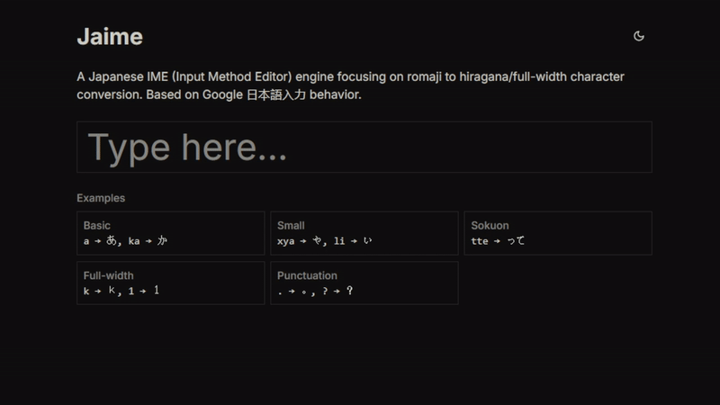

# Jaime

A Japanese IME (Input Method Editor) engine for Zig projects, focusing on romaji to hiragana/full-width character conversion. Based on Google 日本語入力 behavior.

<table>
<tr>
<td>

On the **terminal** with libvaxis

[View repository](https://github.com/egegungordu/ja-ime-terminal-demo)


</td>
<td>

On the **web** with webassembly

[Online demo](https://jaime-wasm.pages.dev/)



</td>
</tr>
</table>

## Zig Version

The minimum Zig version required is 0.13.0.

## Licensing Information

This project includes the **IPADIC dictionary**, which is provided under the license terms stated in the accompanying `COPYING` file. The IPADIC license imposes additional restrictions and requirements on its usage and redistribution. If your application cannot comply with the terms of the IPADIC license, consider using the `ime_core` module with a custom dictionary implementation instead.

## Integrating jaime into your Zig Project

You first need to add jaime as a dependency in your `build.zig.zon` file:

```bash
zig fetch --save git+https://github.com/egegungordu/jaime
```

Then instantiate the dependency in your `build.zig`:

```zig
const jaime = b.dependency("jaime", .{});
exe.root_module.addImport("kana", jaime.module("kana"));         // For simple kana conversion
exe.root_module.addImport("ime_core", jaime.module("ime_core")); // For IME without dictionary
exe.root_module.addImport("ime_ipadic", jaime.module("ime_ipadic")); // For IME with IPADIC dictionary
```

## Usage

The library provides three modules for different use cases:

### 1. Kana Module - Simple Conversions

For simple romaji to hiragana conversions without IME functionality:

```zig
const kana = @import("kana");

// Using a provided buffer (no allocations)
var buf: [100]u8 = undefined;
const result = try kana.convertBuf(&buf, "konnnichiha");
try std.testing.expectEqualStrings("こんにちは", result);

// Using an allocator (returns owned slice)
const result2 = try kana.convert(allocator, "konnnichiha");
defer allocator.free(result2);
try std.testing.expectEqualStrings("こんにちは", result2);
```

### 2. IME IPADIC Module - Full Featured IME

For applications that want to use the full-featured IME with the IPADIC dictionary:

```zig
const ime_ipadic = @import("ime_ipadic");

// Using owned buffer (with allocator)
var ime = ime_ipadic.ImeIpadic(.owned).init(allocator);
defer ime.deinit();

// Using borrowed buffer (fixed size, no allocations)
var buf: [100]u8 = undefined;
var ime = ime_ipadic.ImeIpadic(.borrowed).init(&buf);

// Common IME operations
const result = try ime.insert("k");
const result2 = try ime.insert("o");
const result3 = try ime.insert("n");
try std.testing.expectEqualStrings("こん", ime.input.buf.items());

// Cursor movement and editing
ime.moveCursorBack(1);   // Move cursor left n positions
try ime.insert("y");     // Insert at cursor
ime.clear();             // Clear the buffer
ime.deleteBack();        // Delete the last character
ime.deleteForward();     // Delete the next character
```

> [!WARNING]  
> The IPADIC dictionary is subject to its own license terms. If you need to use a different dictionary or want to avoid IPADIC's license requirements, use the `ime_core` module with your own dictionary implementation.

### 3. IME Core Module - Custom Dictionary

For applications that want to use IME functionality with their own dictionary implementation:

```zig
const ime_core = @import("ime_core");

// Create your own dictionary loader that implements the required interface
const MyDictLoader = struct {
    pub fn loadDictionary(allocator: std.mem.Allocator) !Dictionary {
        // Your dictionary loading logic here
    }

    pub fn freeDictionary(dict: *Dictionary) void {
        // Your dictionary cleanup logic here
    }
};

// Use the IME with your custom dictionary
var ime = ime_core.Ime(MyDictLoader).init(allocator);
defer ime.deinit();
```

## WebAssembly Bindings

For web applications, you can build the WebAssembly bindings:

```bash
# Build the WebAssembly library
zig build
```

For a complete example of how to use the WebAssembly bindings in a web application, check out the [web example](examples/web/index.js).

The WebAssembly library provides the following functions:

```javascript
// Initialize the IME
init();

// Get pointer to input buffer for writing input text
getInputBufferPointer();

// Insert text at current position
// length: number of bytes to read from input buffer
insert(length);

// Get information about the last insertion
getDeletedCodepoints(); // Number of codepoints deleted
getInsertedTextLength(); // Length of inserted text in bytes
getInsertedTextPointer(); // Pointer to inserted text

// Cursor movement and editing
deleteBack(); // Delete character before cursor
deleteForward(); // Delete character after cursor
moveCursorBack(n); // Move cursor back n positions
moveCursorForward(n); // Move cursor forward n positions
```

Example usage in JavaScript:

```javascript
// Initialize
init();

// Get input buffer
const inputPtr = getInputBufferPointer();
const inputBuffer = new Uint8Array(memory.buffer, inputPtr, 64);

// Write and insert characters one by one
const text = "ka";
for (const char of text) {
  // Write single character to buffer
  const bytes = new TextEncoder().encode(char);
  inputBuffer.set(bytes);

  // Insert and get result
  insert(bytes.length);

  // Get the inserted text
  const insertedLength = getInsertedTextLength();
  const insertedPtr = getInsertedTextPointer();
  const insertedText = new TextDecoder().decode(
    new Uint8Array(memory.buffer, insertedPtr, insertedLength)
  );

  // Check if any characters were deleted
  const deletedCount = getDeletedCodepoints();

  console.log({
    inserted: insertedText,
    deleted: deletedCount,
  });
}
// Final result is "か"
```

## Testing

To run the test suite:

```bash
zig build test --summary all
```

## Features

- Romaji to hiragana/full-width character conversion based on Google 日本語入力 mapping
  - Basic hiragana (あ、い、う、え、お、か、き、く...)
    - a -> あ
    - ka -> か
  - Small hiragana (ゃ、ゅ、ょ...)
    - xya -> や
    - li -> ぃ
  - Sokuon (っ)
    - tte -> って
  - Full-width characters
    - k -> ｋ
    - 1 -> １
  - Punctuation
    - . -> 。
    - ? -> ？
    - [ -> 「

## Contributing

Contributions are welcome! Please feel free to open an issue or submit a Pull Request.

## Acknowledgments

- Based on [Google 日本語入力](https://www.google.co.jp/ime/) transliteration mappings
- [mozc](https://github.com/google/mozc) - Google's open source Japanese Input Method Editor, which provided valuable insights for IME implementation
- The following projects were used as a reference for the codebase structure:
  - [chipz - 8-bit emulator in zig](https://github.com/floooh/chipz)
  - [zg - Unicode text processing for zig](https://codeberg.org/atman/zg)

## Further Reading & References

For those interested in the data structures and algorithms used in this project, or looking to implement similar functionality, the following academic papers provide excellent background:

- [Efficient dictionary and language model compression for input method editors](https://aclanthology.org/W11-3503/) - Describes techniques for compressing IME dictionaries while maintaining fast lookup times
- [Space-efficient static trees and graphs](https://doi.org/10.1109/SFCS.1989.63533) - Introduces fundamental succinct data structure techniques that enable near-optimal space usage while supporting fast operations
- [最小コスト法に基づく形態素解析における CPU キャッシュの効率化](https://www.anlp.jp/proceedings/annual_meeting/2023/pdf_dir/C2-4.pdf) - Discusses CPU cache optimization techniques for morphological analysis using minimum-cost methods
- [Vibrato](https://github.com/daac-tools/vibrato) - Viterbi-based accelerated tokenizer
- [Vaporetto: 点予測法に基づく高速な日本語トークナイザ](https://www.anlp.jp/proceedings/annual_meeting/2022/pdf_dir/D2-5.pdf) - Presents a fast tokenization approach using linear classification and point prediction methods and three novel score preprocessing techniques
- [Vaporetto](https://github.com/daac-tools/vaporetto?tab=readme-ov-file) - Implementation of the pointwise prediction tokenizer described in the paper above
